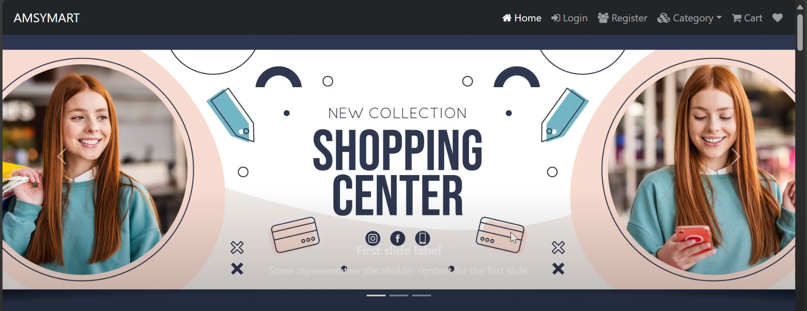
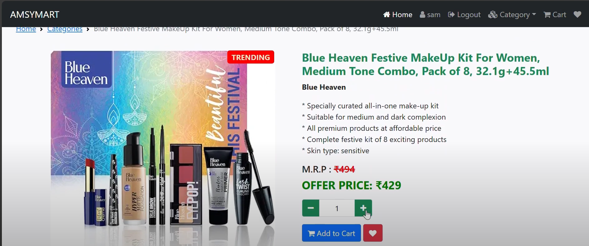
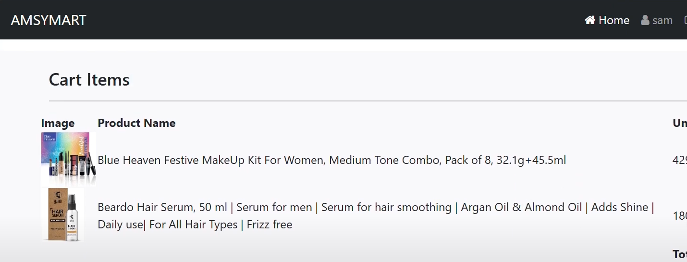
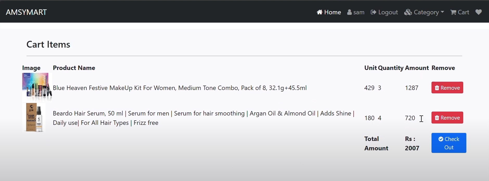

# 🛍️ E-Commerce Website

> A complete e-commerce web application built using Django and MySQL with responsive frontend and full shopping functionality.  
>  
> 🎥 [Click here to see the working demo](https://youtu.be/nEphcJEyTxY?si=ktsRUJJ9Q8j_ZXEc)

---

## 🔍 Overview

This is a full-stack Django-based e-commerce application with core shopping features like product listing, cart management, and order summary. It uses Django's built-in template engine and admin panel to handle frontend rendering and backend management in one cohesive MVP (Minimum Viable Product).

---

## ✨ Features

- 🛍️ Product Listing with images and pricing
- 🛒 Add to Cart / Remove from Cart
- 🧾 Order Summary Page
- 📱 Responsive UI with Bootstrap
- 🔍 Product Search and Filtering
- 🧑 Admin Interface for product management
- 🧠 Server-side routing using Django views
- 📊 MySQL database integration

---

## 🧰 Tech Stack

| Layer           | Technology                                |
|------------------|--------------------------------------------|
| **Language**     | Python                                     |
| **Framework**    | Django                                     |
| **Frontend**     | HTML5, CSS3, JavaScript                    |
| **Styling**      | Bootstrap 5, CSS Modules                   |
| **Routing**      | Django URLs & Views (No separate frontend) |
| **Database**     | MySQL                                      |

---

## 📸 Screenshots

> *(Visual overview of the project)*

